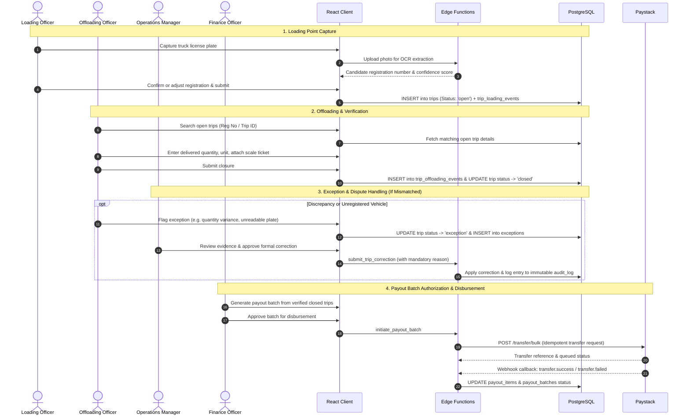
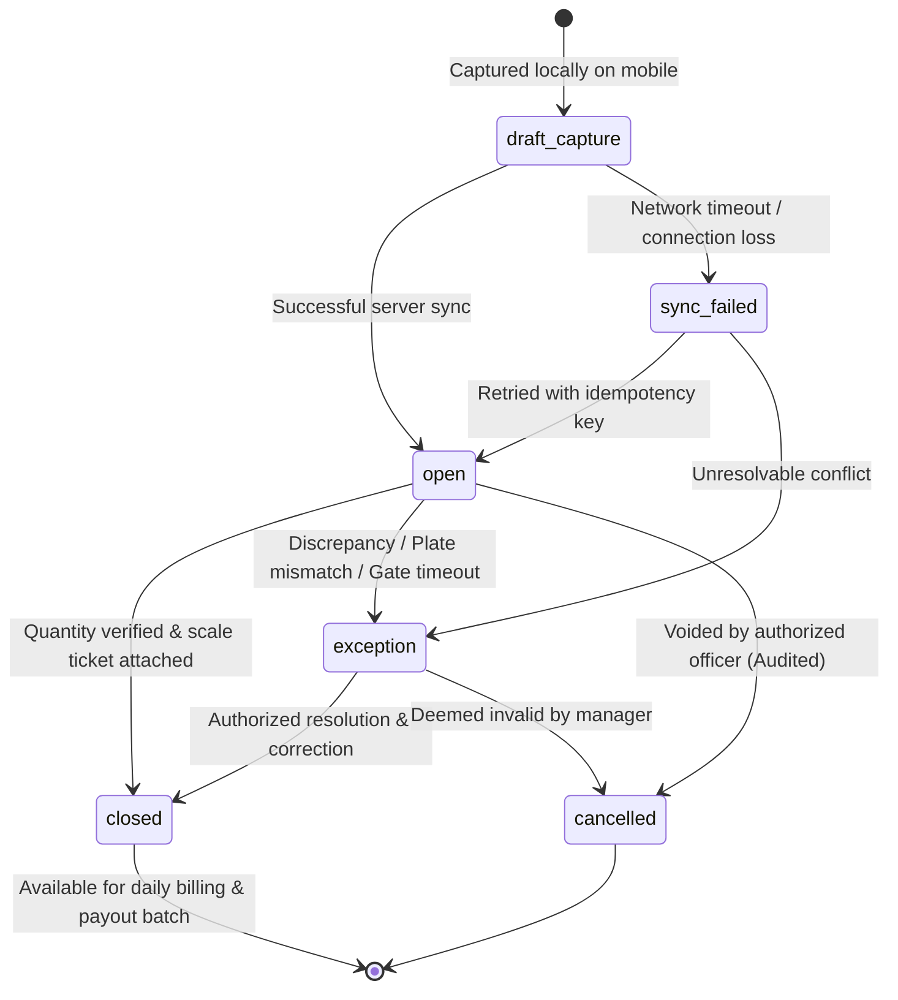

# Sand Dredging Truck Movement Waybill & Revenue Assurance System

> **Adams Project** — Operational Assurance, Real-time Field Verification, and Financial Reconciliation System for Sand Dredging and Haulage Operations.

---

## 📌 Executive Summary

The **Sand Dredging Truck Movement Waybill and Revenue Assurance System** provides end-to-end operational visibility, fraud mitigation, and revenue assurance across sand dredging, loading, haulage, and offloading workflows.

Derived from the **Adams Project Technical Design Specification** (based on the Business Requirements Document dated 11 September 2026), this system establishes an immutable, event-driven ledger for every truck movement. It eliminates revenue leakage caused by manual tallying, unverified round-trips, overloaded/under-reported capacities, and unauthorized diversions.

---

## 🎯 Key Technical Objectives

* **Single Trip Record Integrity**: Every truck entry creates a unique, immutable trip event with strictly validated status transitions. Overwriting historical records is prohibited.
* **Fast Field Capture**: Mobile-first field workflow combining camera capture, OCR number-plate candidate extraction, and one-tap operator confirmation to minimize queue latency at loading gates.
* **Derived Revenue Assurance**: Real-time revenue and volume statistics are derived directly from verified event-level transactions rather than manual, post-hoc aggregate logs.
* **End-to-End Auditability**: Comprehensive audit log recording who captured, modified, approved, or cancelled material records, retaining prior and updated values with mandatory reason codes.
* **Controlled Role-Based Access (RBAC)**: Enforced through Supabase Auth and PostgreSQL Row-Level Security (RLS) with partitioned views separating operational data from sensitive payment and KYC information.
* **Paystack Financial Automation Readiness**: Structured collection of business compliance documents (CAC, TIN, KYC), bank account verification, batch payout authorization, and idempotent transfer initiation via Paystack.

---

## 🏛️ System Architecture

The architecture utilizes a modern, cloud-native stack optimized for rapid mobile field interaction, strong relational constraints, private asset storage, and decoupled serverless business logic.

```
┌────────────────────────────────────────────────────────────────────────┐
│                        Field & Office Clients                          │
│        React (TypeScript) + PWA / Responsive Mobile & Desktop          │
└───────────────┬────────────────────────────────────────┬───────────────┘
                │ Direct RLS Queries                     │ Privileged Operations
                ▼                                        ▼
┌──────────────────────────────────────┐ ┌───────────────────────────────┐
│     Supabase PostgreSQL Backend      │ │    Supabase Edge Functions    │
│  - Row-Level Security (RLS) Policies │ │  - OCR Orchestration Service  │
│  - Relational Integrity & Triggers   │ │  - Trip Correction & Auditing │
│  - Transactional Trip Logs           │ │  - Paystack Transfer & Hooks  │
│  - Event-derived Reporting Views     │ │  - Controlled Report Exports  │
└──────────────────┬───────────────────┘ └───────────────┬───────────────┘
                   │                                     │
         ┌─────────┴─────────┐                 ┌─────────┴─────────┐
         ▼                   ▼                 ▼                   ▼
┌──────────────────┐ ┌────────────────┐ ┌──────────────┐ ┌────────────────┐
│ Supabase Storage │ │ Supabase Auth  │ │   Paystack   │ │  OCR Provider  │
│ (Private Buckets)│ │ (JWT, RBAC)    │ │ Payment API  │ │ Vision Engine  │
└──────────────────┘ └────────────────┘ └──────────────┘ └────────────────┘
```

### Technology Stack

| Layer | Technology | Primary Responsibilities |
| :--- | :--- | :--- |
| **Client Frontend** | **React + TypeScript** | Mobile-first loading/offloading screens, offline draft queue, live dashboard, exception triage, and compliance administration. |
| **Backend & DB** | **Supabase (PostgreSQL)** | Transactional records, relational constraints, Row-Level Security (RLS), real-time notifications, and immutable audit logs. |
| **Authentication** | **Supabase Auth** | Secure session handling, role claims, password policies, and multi-factor authentication (MFA) for managers and admins. |
| **Edge Compute** | **Supabase Edge Functions** | Plate extraction orchestration, trip corrections, Paystack transfer initiation, webhook verification, and privileged exports. |
| **Object Storage** | **Supabase Storage** | Private encrypted buckets for plate photos, weighbridge scale tickets, digital waybills, and KYC compliance records. |
| **Payment Gateway**| **Paystack** | Driver/vendor recipient creation, batch transfer initiation, webhook status reconciliation, and automated disbursement. |
| **Source & CI/CD** | **GitHub Enterprise** | Branch protections, automated lint/type/migration CI pipelines, release tagging, and secret governance. |

---

## 👥 User Roles & Access Control (RBAC)

The application enforces strict separation of concerns via database-level policies:

| Role | Core Responsibilities | Explicit Restrictions |
| :--- | :--- | :--- |
| **Loading Officer** | Captures plate photo at dredge gate, confirms registration, creates open trip record, monitors assigned site queue. | Cannot close trips, edit past quantities, or access financial/payout records. |
| **Offloading Officer** | Identifies open trip at discharge site, enters delivered volume/tonnage, attaches weighment ticket/waybill, closes trip. | Cannot modify master data, edit loading events, or view payment profiles. |
| **Operations Manager** | Real-time operations monitoring, bottleneck identification, exception assignment, operational correction approval. | Restricted from executing or approving financial disbursements unless granted. |
| **Finance Officer** | Reviews verified quantity totals, manages driver/vendor bank profiles, approves payout batches, reconciles Paystack transfers. | Cannot alter operational trip evidence or bypass two-party payout approvals. |
| **System Administrator**| Configures sites, trucks, drivers, system parameters, user roles, and system health. | Subject to immutable audit-log recording; cannot modify raw financial ledger entries directly. |
| **Audit Reviewer** | Inspects immutable audit logs, plate evidence, discrepancy trails, correction histories, and export footprints. | Read-only access across the entire operational lifecycle. |

---

## 🔄 Core Operational Workflows



---

## 📊 Trip Lifecycle State Machine



* **`draft_capture`**: Stored locally in mobile indexed storage pending network transmission.
* **`open`**: Loading event registered; vehicle in transit to destination.
* **`closed`**: Verified delivery recorded with weight/volume and sign-off.
* **`exception`**: Flagged for managerial review due to route anomalies, unlisted plate, or cargo variance.
* **`cancelled`**: Voided entry, permanently logged with operator justification.
* **`sync_failed`**: Connectivity interrupted during submission; cached locally for guaranteed idempotent retry.

---

## 🗄️ Relational Data Model

The PostgreSQL schema enforces referential integrity, check constraints, canonical registration normalization, and strict audit partitioning.

```
                    ┌─────────────────────────┐
                    │          sites          │
                    └────────────┬────────────┘
                                 │ 1:N
┌─────────────────────────┐      │      ┌─────────────────────────┐
│         trucks          │      │      │         drivers         │
└────────────┬────────────┘      │      └────────────┬────────────┘
             │ 1:N               │                   │ 1:N
             │      ┌────────────▼────────────┐      │
             ├─────►│          trips          │◄─────┤
             │      └────────────┬────────────┘      │
             │                   │ 1:1               │
             │      ┌────────────▼────────────┐      │
             │      │   trip_loading_events   │      │
             │      └─────────────────────────┘      │
             │                   │ 1:1               │
             │      ┌────────────▼────────────┐      │
             │      │  trip_offloading_events │      │
             │      └─────────────────────────┘      │
             │                   │ 1:N               │
             │      ┌────────────▼────────────┐      │
             │      │       exceptions        │      │
             │      └─────────────────────────┘      │
             │                                       │
             │      ┌─────────────────────────┐      │
             └─────►│ truck_driver_assignment │◄─────┘
                    └─────────────────────────┘
                                 ▲
                                 │
                    ┌────────────┴────────────┐
                    │    payment_profiles     │
                    └────────────┬────────────┘
                                 │ 1:N
                    ┌────────────▼────────────┐
                    │      payout_items       │
                    └────────────▲────────────┘
                                 │ N:1
                    ┌────────────┴────────────┐
                    │      payout_batches     │
                    └─────────────────────────┘
```

### Core Table Definitions

| Table | Purpose | Essential Fields |
| :--- | :--- | :--- |
| **`sites`** | Dredging pits, loading docks, and offloading depots. | `id` (UUID), `name`, `site_type` (`loading` \| `offloading`), `status`, `timezone` |
| **`trucks`** | Authorized transport vehicles. | `id`, `registration_number`, `normalized_registration` (canonical index), `capacity`, `owner_name`, `status` |
| **`drivers`** | Registered haulage drivers. | `id`, `full_name`, `phone`, `status`, `payment_profile_id` |
| **`truck_driver_assignments`** | Effective-dated truck-to-driver mappings. | `id`, `truck_id`, `driver_id`, `effective_from`, `effective_to`, `status` |
| **`trips`** | Primary ledger tracking each movement cycle. | `id`, `trip_number`, `truck_id`, `driver_id`, `loading_site_id`, `offloading_site_id`, `status`, `loaded_at`, `closed_at` |
| **`trip_loading_events`** | Gate capture details at dredging point. | `id`, `trip_id`, `plate_image_file_id`, `extracted_number`, `confirmed_number`, `confidence_score`, `captured_by` |
| **`trip_offloading_events`**| Delivered quantity validation and closure. | `id`, `trip_id`, `quantity`, `unit` (`tonnes` \| `m3` \| `truckloads`), `weighed_at`, `evidence_file_id`, `closed_by` |
| **`evidence_files`** | Tamper-evident references to stored images/files. | `id`, `bucket`, `object_path`, `file_type`, `checksum` (SHA-256), `uploaded_by`, `uploaded_at` |
| **`exceptions`** | Anomalies, volume disputes, and unlisted plates. | `id`, `trip_id`, `exception_type`, `description`, `status`, `owner_id`, `resolved_at` |
| **`payout_batches`** | Finance-approved disbursement runs. | `id`, `period_start`, `period_end`, `status`, `gross_amount`, `approved_by`, `paystack_transfer_reference` |
| **`payout_items`** | Line-item payments per driver or vehicle contractor. | `id`, `payout_batch_id`, `driver_id`, `trip_count`, `quantity_total`, `amount`, `status`, `transfer_code` |
| **`payment_profiles`** | Restricted banking details for Paystack recipient setup. | `id`, `driver_id`, `bank_code`, `account_last4`, `account_name`, `paystack_recipient_code`, `status` |
| **`business_compliance_docs`**| KYC and onboarding documents for Paystack corporate compliance. | `id`, `document_type`, `registration_number`, `file_id`, `status`, `reviewed_by`, `reviewed_at` |
| **`audit_log`** | Immutable record of all state transitions and updates. | `id`, `entity_name`, `entity_id`, `action`, `old_value` (JSONB), `new_value` (JSONB), `reason`, `actor_id`, `created_at` |

---

## 🔒 Security, Compliance & Data Governance

### 1. Row-Level Security (RLS) Matrix
* **Operational Isolation**: Field officers can only query records associated with their assigned active site and cannot read financial or payment tables.
* **Storage Protection**: Evidence buckets (`plate-images`, `scale-tickets`, `compliance-docs`) are strictly private. Access requires time-limited signed URLs (TTL $\le$ 15 minutes) issued via authorized Edge Functions.
* **Service Role Safeguards**: The Supabase `service_role` key is never exposed to the client; privileged actions run exclusively within authenticated Edge Functions.

### 2. Corporate KYC & Paystack Compliance Onboarding
To meet Nigerian regulatory compliance and Paystack business verification criteria, the system provides secure document collection:
* **Corporate Identity**: CAC Certificate of Incorporation, Status Report / Forms, Memorandum & Articles of Association.
* **Tax Governance**: Corporate Tax Identification Number (TIN).
* **Director Verification**: Director Government ID, BVN Consent, and Verified Residential Proof of Address.
* **Anti-Money Laundering**: Special Control Unit Against Money Laundering (SCUML) Certificate (where applicable).
* **Settlement Account**: Designated Nigerian corporate bank account matching CAC records.

---

## 🚀 Environment & Deployment Strategy

```
  [ Feature Branch ]
          │
          ▼  Pull Request & Review
  [ GitHub Enterprise CI ] ──► Unit Tests, Linter, Types, Migration Dry-Run
          │
          ▼  Merge to main / develop
┌───────────────────┬───────────────────┬───────────────────┬───────────────────┐
│    Development    │    Test / QA      │    UAT / Pilot    │    Production     │
├───────────────────┼───────────────────┼───────────────────┼───────────────────┤
│ Local Supabase CLI│ Automated Staging │ Single Dredge Site│ High-Availability │
│ Seed mock data    │ Multi-role test   │ Field evaluation  │ Live ledger       │
│ Feature validation│ Full regression   │ User sign-off     │ Protected DB      │
└───────────────────┴───────────────────┴───────────────────┴───────────────────┘
```

---

## 📅 Phased Implementation Roadmap

### Phase 1: Operational Foundation (MVP)
* Project scaffolding, GitHub Enterprise CI/CD, Supabase schema migrations, and RLS policies.
* Truck and driver master data management with plate normalization.
* Mobile-responsive Loading Capture with camera input, OCR plate extraction, and human confirmation.
* Offloading verification, quantity entry, and trip closure.
* Operational dashboard with daily trip counts, tonnages, and exception tracking.
* Comprehensive transactional audit logging.

### Phase 2: Evidence & Operational Hardening
* Weighbridge ticket and physical waybill photo attachments with cryptographic checksums.
* Resilient offline draft capture queue with automatic background sync and collision handling.
* Enhanced exception resolution portal with manager sign-offs.
* Paystack onboarding portal for driver KYC and company document collection.
* Export engine for role-partitioned audit reports (PDF/Excel).

### Phase 3: Financial Automation & Deep Integrations
* Automated waybill generation with verifiable QR codes.
* Fully automated Paystack batch payouts with multi-tier approval workflows.
* Real-time Paystack webhook reconciliation engine.
* Direct weighbridge IoT scale integration.
* Fixed-lane optical character recognition (CCTV) cameras at primary dredging terminals.

---

## 💻 Local Development Setup

### Prerequisites
* **Node.js** v20.x or later
* **npm** or **pnpm**
* **Supabase CLI** (`npm install -g supabase`)
* **Docker Desktop** (required for local Supabase emulation)

### Installation & Initialization

1. **Clone the Repository**
   ```bash
   git clone https://github.com/your-org/Dredging_Assurance_System.git
   cd Dredging_Assurance_System
   ```

2. **Configure Environment Variables**
   Create a `.env` file in the root directory:
   ```ini
   VITE_SUPABASE_URL=http://localhost:54321
   VITE_SUPABASE_ANON_KEY=your-local-anon-key
   SUPABASE_SERVICE_ROLE_KEY=your-local-service-role-key
   PAYSTACK_SECRET_KEY=sk_test_xxxxxxxxxxxxxxxxxxxxxxxx
   PAYSTACK_PUBLIC_KEY=pk_test_xxxxxxxxxxxxxxxxxxxxxxxx
   ```

3. **Start Local Supabase Services**
   ```bash
   supabase start
   supabase db reset
   ```

4. **Install Dependencies & Launch App**
   ```bash
   npm install
   npm run dev
   ```

5. **Execute Test Suite**
   ```bash
   npm run test
   npm run lint
   ```

---

## 📄 License & Governance

Proprietary and Confidential — Built for the **Adams Project** stakeholders. All rights reserved. Unauthorized reproduction, distribution, or reverse-engineering is strictly prohibited.
